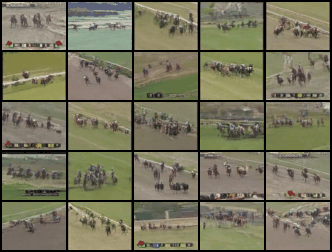

# SoSORA - Hourglass Diffusion Transformer with 1.58 bit QAT

[Download checkpoint](https://drive.google.com/file/d/13hHhsRNcHSs-85i29InjpSr7BgEqhf7i/view?usp=sharing)



## Training

Download and extract UCF-101 Dataset from [here](https://www.crcv.ucf.edu/data/UCF101.php)

```
accelerate launch train_ucf101.py
```
